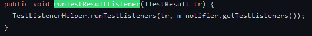
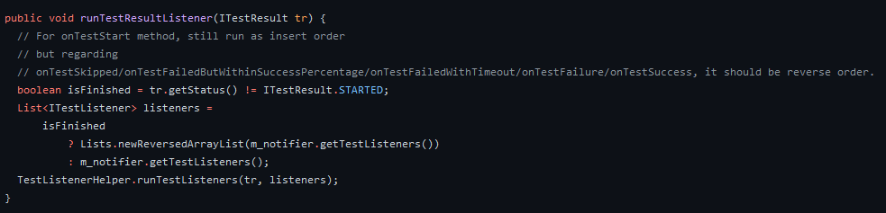

## Allure Attachments with TestNG 7.5 Example

### Breaking change
In TestNG 7.4.0 running the registered test listeners looks like this:

These listeners run twice, once on the test start up and once when the test is finished.

In TestNG 7.5 with [GITHUB-2558](https://github.com/cbeust/testng/pull/2627) they changed the order these listeners run
on test finish, basically it runs in reverse order then on test start

Since Allure also works with a TestNG `ITestListener` as well, this means that the test is closed in Allure before your
attachment listener could run.

### Solution
Allure also has a lifecycle listener feature. You can hook onto and run code on various lifecycle events of Steps,
 Fixtures and of course even Test too. Check `LifecycleListener` interface and all of its child interfaces for the full list.

For this example I want to attach a screenshot to my Allure report when the test is broken or fails

#### Steps
##### 1. Create your Listener implementation
I have created [a custom TestLifecycleListener](/src/test/java/matebiczo/example/listener/AllureTestLifecycleListener.java)
for my problem. In my opinion `TestLifecycleListener` is pretty similar to TestNG's `ITestListener`. It should be
straightforward to rework your TestNG listener to an Allure listener.
##### 2. Register your Listener
Registering an Allure listener is just a bit more complicated than with TestNG. Allure uses the
[Service Provider Interface (SPI)](https://docs.oracle.com/javase/tutorial/sound/SPI-intro.html) to load listeners in runtime.
To your listener to be loadable through SPI you have to create the following directory structure:
`/META-INF/services/` with a file in the services directory. The file name should be the fully qualified name of the interface
you have implemented.
So since I have created a `TestLifecycleListener` implementation, the file name is `io.qameta.allure.listener.TestLifecycleListener`.
In this file you can specify your implementations with fully qualified names. Each name should be on its separate line.
So in my case the file content is just: `matebiczo.example.listener.AllureTestLifecycleListener`
##### 3. Enjoy your attachments
That's all you have to do to use Allure's lifecycles for attachments. In my opinion it is even a better solution than using
TestNG's lifecycles, since we want to use a feature related to Allure and this way we don't rely on TestNG changes in the future
that heavily.